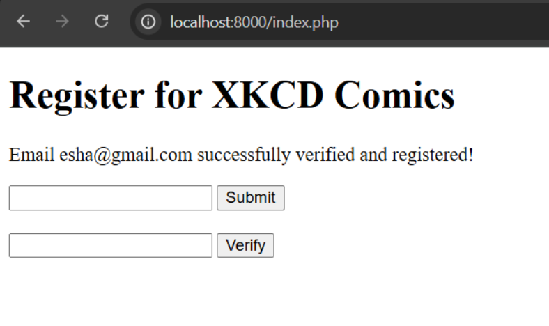
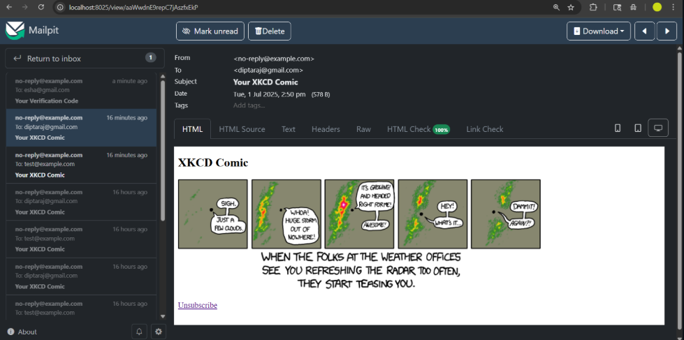
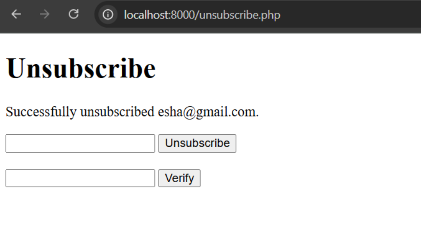

# XKCD Comic Email Subscription System 📩

A PHP-based subscription system that allows users to register via email to receive a **daily XKCD comic**. It includes email verification, unsubscription with confirmation, and a scheduled CRON job to deliver comics every 24 hours.

---

## 🚀 Features

✅ Email Verification  
✅ Daily XKCD Comic via Email  
✅ Unsubscribe with Confirmation  
✅ CRON Job Integration  
✅ HTML Email Format  
✅ No database used (uses `registered_emails.txt`)  
✅ Tested locally with [Mailpit](https://github.com/axllent/mailpit)

---

## 📸 Screenshots

> Screenshots of local testing using Mailpit

| Registration Form | Comics | Unsubscribe |
|-------------------|--------------------|-------------|
|  |  |  |

---

## 📂 File Structure

laugh-with-us/
1. index.php # Email registration + verification
2. unsubscribe.php # Unsubscribe via code verification
3. cron.php # Sends XKCD comics to subscribers
4. setup_cron.sh # Adds cron job for daily delivery
5. functions.php # Core business logic
6. registered_emails.txt # Local email storage
7. Screenshots/ # UI screenshots
8. README.md # This file

---

## 📌 How It Works

### 🔐 Email Verification
1. User enters their email → clicks Submit
2. Receives a 6-digit code via email
3. Enters code to confirm and gets subscribed
4. Email stored in `registered_emails.txt`

### 📤 Daily Comic Delivery
- A CRON job runs `cron.php` every day at 9:00 AM
- Fetches random XKCD comic from https://xkcd.com/
- Sends HTML email with:
  - Comic image
  - Unsubscribe link

### 🚫 Unsubscribe Flow
1. User clicks "Unsubscribe" from the email
2. Enters their email → receives code
3. Enters code to confirm unsubscription
4. Email removed from `registered_emails.txt`

---

## ⚙️ Setup Instructions

### 🛠 Requirements
- PHP 8.3+
- Mailpit (for local email testing)
- Apache or PHP built-in server
- Unix-based OS for CRON (Linux/macOS/WSL)

### 🔧 Installation

1. Clone the repo:
```bash
git clone https://github.com/DiptarajSinha/laugh-with-me.git
cd laugh-with-me
```
2. Start PHP server:

```bash
Copy
Edit
php -S localhost:8000
```
3. Open browser:
 ```
http://localhost:8000/index.php
```
4. Start Mailpit in a new terminal:

```bash
Copy
Edit
mailpit
```
5. Setup CRON:

```bash
Copy
Edit
bash setup_cron.sh
```
🧪 Testing Email Delivery
Emails can be viewed locally at ```http://localhost:8025``` (Mailpit UI).

🧼 Notes
Email format strictly follows:

Your Verification Code

Your XKCD Comic (with <h2>, , and unsubscribe link)

Confirm Un-subscription

No database used. All emails stored in registered_emails.txt

🙋‍♂️ Author
Diptaraj Sinha
GitHub | LinkedIn

🏁 License
This project is for educational/demo purposes only. No copyright infringement intended.

yaml
Copy
Edit

---
